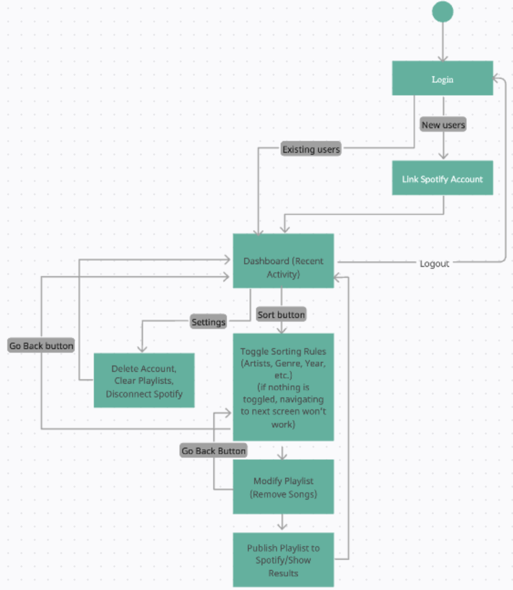
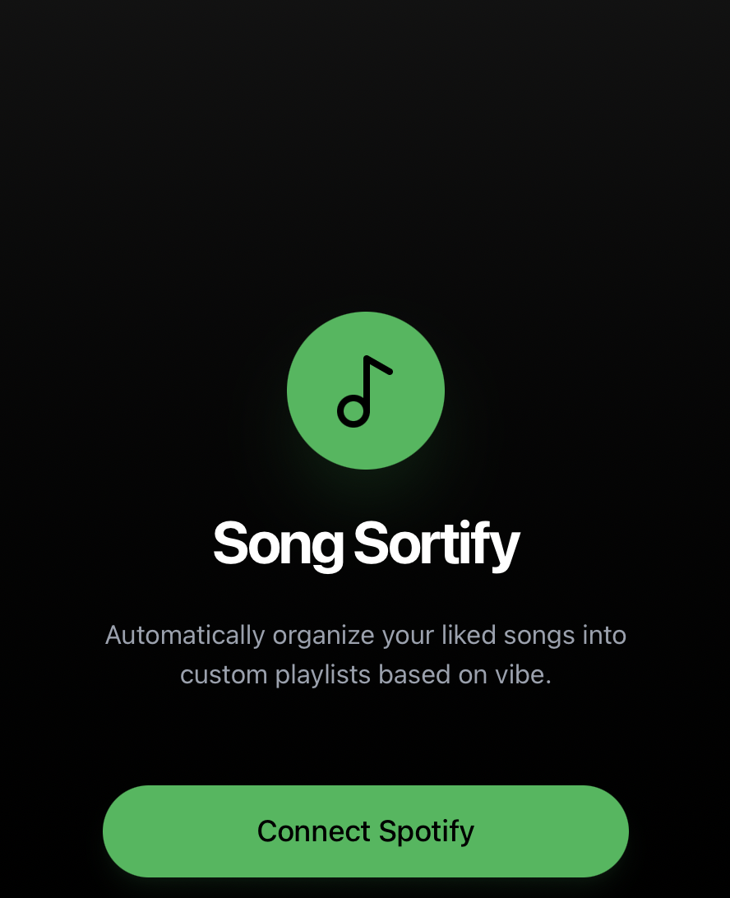
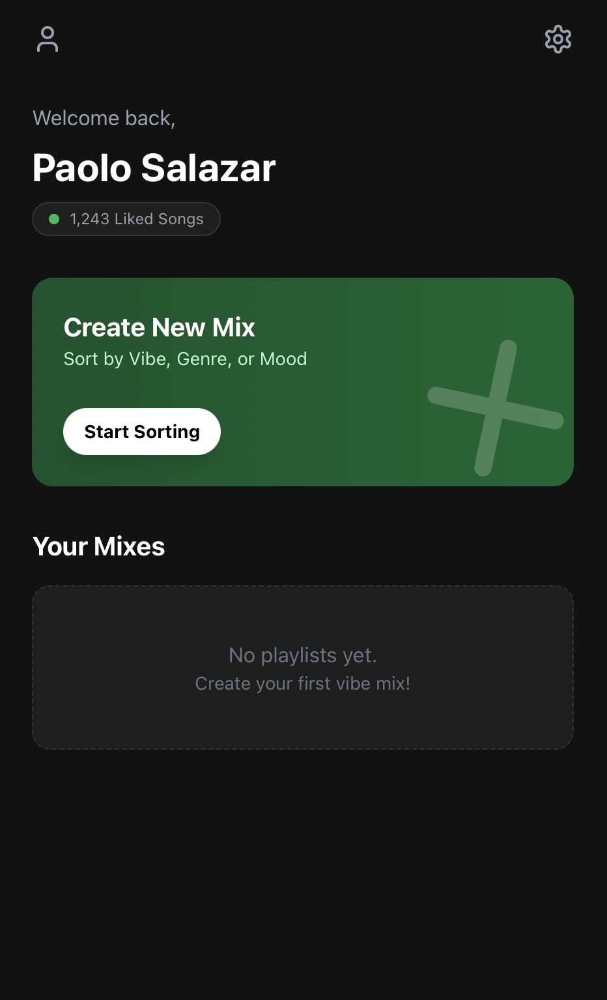
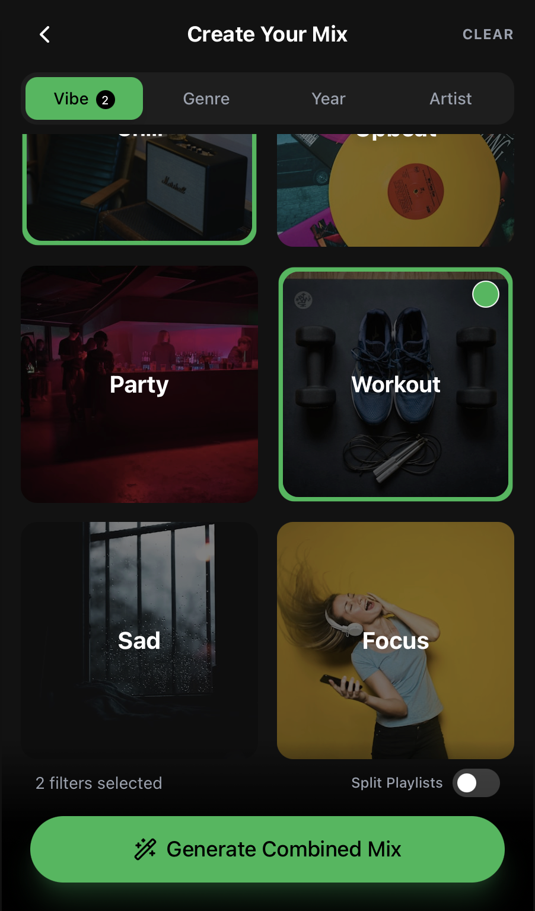
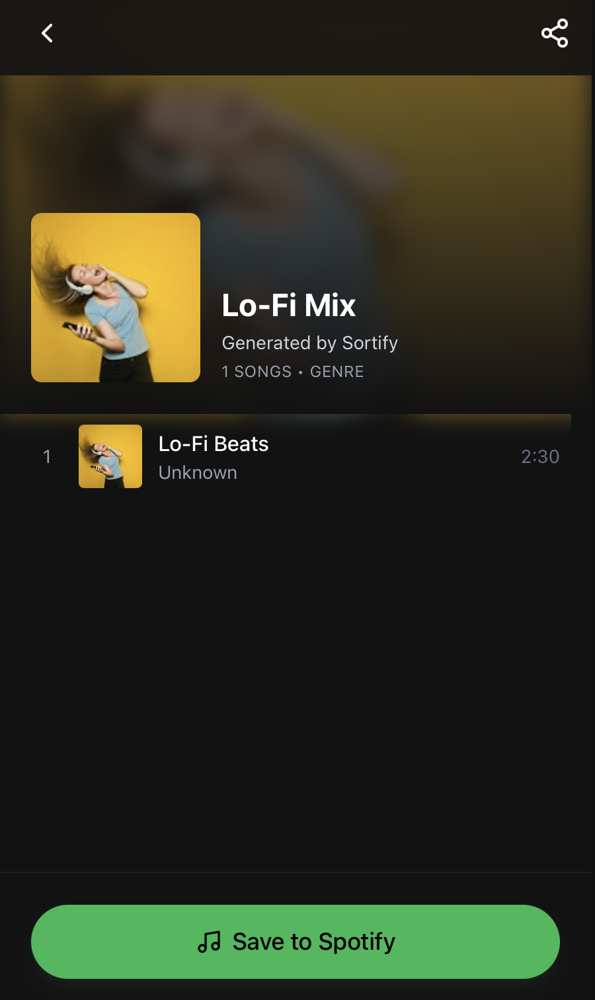
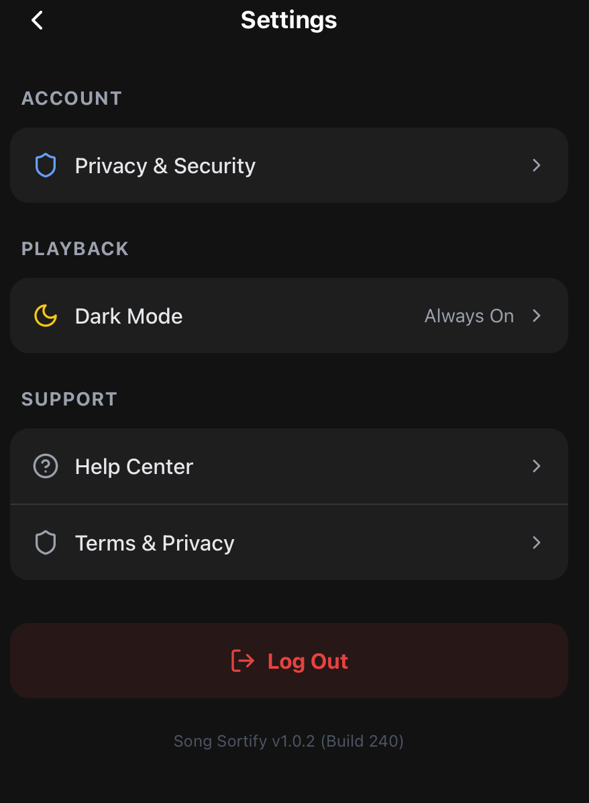
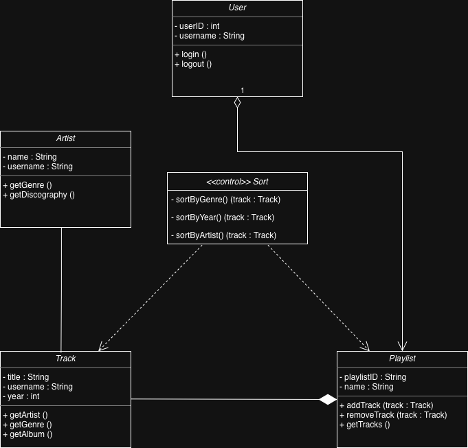
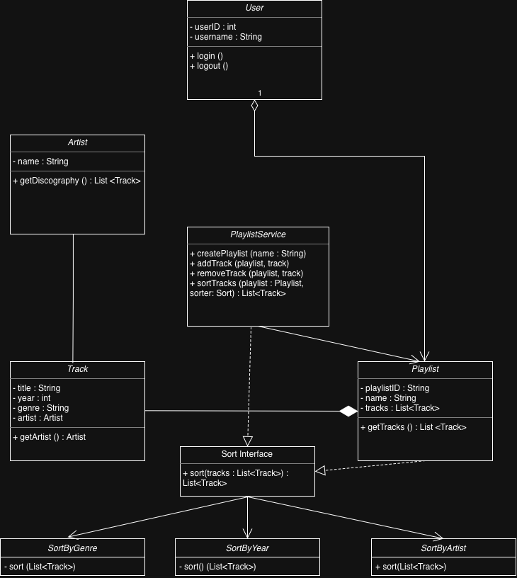
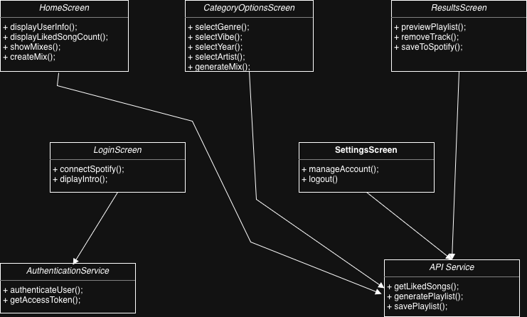

[](https://classroom.github.com/a/xLkBlQ7x)
[](https://classroom.github.com/open-in-codespaces?assignment_repo_id=22403529)

# Song Sortify (Spotify Playlist Sorter)
 
Authors:  
[Suraj Yarrapathruni](https://github.com/suraj2123)  

## Project Description

 Song Sortify is a mobile application that connects to a user’s Spotify account and automatically organizes their liked songs into custom playlists based on genre and overall “vibe.” Many Spotify users accumulate hundreds or even thousands of liked songs over time, making it difficult to manually create organized playlists. This project automates that process and allows users to enjoy their music in a more structured and personalized way.

**Why is it important or interesting to us?**  
This project is important and interesting to our team because we personally experience the challenge of having too many liked songs without the time or motivation to sort them into playlists. Music listening often becomes random instead of matching a specific mood or genre. Song Sortify solves this problem by instantly creating playlists that fit different vibes such as chill, upbeat, or specific genres like hip-hop or EDM.

**Languages, tools, and technologies we plan to use:**  
- Backend: Python  
- Mobile Development: Expo Go and React Native  
- Frontend/UI: HTML, CSS, and JavaScript  
- Database: SQL for storing user account information and Spotify-related data  
- APIs: Spotify Web API for retrieving liked songs and creating playlists and Last.FM for labelling songs (Hip-Hop, Chill, 2000s, Artists, etc.)

**Input / Output:**  
- Input: User’s Spotify account authentication, liked songs retrieved from Spotify, and user-selected playlist categories (genres or vibes)  
- Output: Automatically generated Spotify playlists based on selected categories, integrated directly into the user’s Spotify account  

**Features provided by the project:**  
- Spotify account login and authentication  
- Retrieval of user’s liked songs using the Spotify API  
- Dynamic category generation based on genres present in the user’s liked songs  
- User selection of desired playlist types such as Hip-Hop, Pop, K-Pop, EDM, Chill, Sad, and Bedroom/Lo-fi  
- Automatic sorting of songs into corresponding playlists  
- Playlist creation and integration directly into Spotify  
- User account system stored in a SQL database  

This project includes API integration, database management, automated data processing, and a user-friendly interface.

## User Interface Specification

### Navigation Diagram


This diagram illustrates the overall user flow and screen navigation for the Song Sortify application. Users begin at the Login screen. New users are prompted to link their Spotify account, while existing users are taken directly to the Dashboard, which displays recent activity.
From the Dashboard, users can access core features of the app. Using the Sort button, they can define sorting rules (such as artist, genre, year, or vibe) to automatically organize their liked songs into playlists. Before finalizing, users can modify playlists by removing songs, then publish the playlist to Spotify and view the results.
The Settings option allows users to manage their account, including deleting their account, clearing playlists, or disconnecting Spotify. Users can log out at any time, returning them to the login screen.

### Screen Layouts
## Opening Page


The Opening Page introduces Song Sortify and allows users to create an account by connecting their Spotify account. The screen displays a brief description of the app’s purpose, and a Connect Spotify button that enables users to access the app’s features.
## Home Page


The Home Page serves as the main dashboard. It displays the user’s name, number of liked songs, and existing mixes (playlists created with the app). A Create New Mix button allows users to begin sorting their music, while icons provide access to account settings and profile options.
## Playlist Category Options Page


This screen allows users to define how their music will be organized. Users can select sorting categories such as Vibe, Genre, Year, or Artist using visual cards and toggles. A Generate Mix button applies the selected filters to create a playlist.
## Results Page


The Results Page displays the generated playlist, including playlist details and a preview of the songs. Users can review the results and use the Save to Spotify button to publish the playlist directly to their Spotify account.
## Settings Page


The Settings Page shows users several options, account, appearance, and support options. It allows users to manage their privacy and security settings, control the app’s display mode, access help resources and legal information, and securely log out of their account.

## Class Diagram
 

The class diagram represents the classes we will use in our Song Sortify project. The User class allows the user to store their user ID and username into their account information. A user can have multiple playlists since playlists belong to the user. The playlist class represents a collection of tracks where a user can add and remove songs as well as getting the songs.The track class represents an individual song and stores its attributes like title and album and year. Each track is associated with to a single artist while an artist can be associated to multiple tracks. The artist class represents the creator of the tracks and stores in the name of the artist and the genre they belong too.
 
 > ## Phase III
 > You will need to schedule a check-in for the second scrum meeting with the same reader you had your first scrum meeting with (using Calendly). Your entire team must be present. This meeting will occur on week 8 during lab time.
 
 > BEFORE the meeting you should do the following:
 > * Update your class diagram from Phase II to include any feedback you received from your TA/grader.
 > * Considering the SOLID design principles, reflect back on your class diagram and think about how you can use the SOLID principles to improve your design. You should then update the README.md file by adding the following:
 >   * A new class diagram incorporating your changes after considering the SOLID principles.
 >   * For each update in your class diagram, you must explain in 3-4 sentences:
 >     * What SOLID principle(s) did you apply?
 >     * How did you apply it? i.e. describe the change.
 >     * How did this change help you write better code?

 

We introduced the sort interface to create abstract sorting behavior. As a result of this, the playlist service now relies on the interface rather than the specific sorting classes. This satisfied the open-closed principles because it allows for new strategies to be added without modifying the existing logic. 

We created separate classes for sorting the genre, year, and artist and implemented a single sorting behavior. This practice incorporates the single responsibility aspect from the SOLID principles. This ensures that the class becomes isolated to solving one condition and only has one reason to be edited or changed.

We made the playlist service class after recalling the SOLID principles. The addition of this class allows us to depend on the abstractions and the playlist service class instead of the playlist. By doing this, we rely on the high level module instead of the low level module.

We changed the sort track to show that the sorting strategy is passed in. We also decided to add a dependency arrow from PlaylistService to the SortInterfacee to show that the Playlist service depends on abstraction as emphasized in the SOLID Principles.

 

Our README contains 5 main screens. A HomeScreen, LoginScreen, OptionsScreen, SettingScreens, and a ResultsScreen for the frontend of this project. These screens represent the layer of the frontend from a logical standpoint and handles the Authentication login.


 > * Perform a new sprint plan like you did in Phase II.
 > * Make sure that your README file (and Project board) are up-to-date reflecting the current status of your project and the most recent class diagram. Previous versions of the README file should still be visible through your commit history.
>  * Each team member should also submit the Peer Evaluation Form on Canvas for phase III. In this form, you need to fill in the names of all team members, the percentage of work contributed by each member for phase III, and a description of their contributions. Remember that each team member should submit the form individually.
 
> During the meeting with your reader you will discuss: 
 > * How effective your last sprint was (each member should talk about what they did)
 > * Any tasks that did not get completed last sprint, and how you took them into consideration for this sprint
 > * Any bugs you've identified and created issues for during the sprint. Do you plan on fixing them in the next sprint or are they lower priority?
 > * What tasks you are planning for this next sprint.

 
 > ## Final deliverable
 > All group members will give a demo to the reader during lab time. ou should schedule your demo on Calendly with the same reader who took your second scrum meeting. The reader will check the demo and the project GitHub repository and ask a few questions to all the team members. 
 > Before the demo, you should do the following:
 > * Complete the sections below (i.e. Screenshots, Installation/Usage, Testing)
 > * Plan one more sprint (that you will not necessarily complete before the end of the quarter). Your In-progress and In-testing columns should be empty (you are not doing more work currently) but your TODO column should have a full sprint plan in it as you have done before. This should include any known bugs (there should be some) or new features you would like to add. These should appear as issues/cards on your Project board.
 > * Make sure your README file and Project board are up-to-date reflecting the current status of your project (e.g. any changes that you have made during the project such as changes to your class diagram). Previous versions should still be visible through your commit history.
>  * Each team member should also submit the Peer Evaluation Form on Canvas for this final phase. In this form, you need to fill in the names of all team members, the percentage of work contributed by each member for the final phase, and a description of their contributions. Remember that each team member should submit the form individually.
 
 ## Screenshots

 Screenshots of the running application are shown in the [Screen Layouts](#screen-layouts) section above (Opening Page, Home Page, Playlist Category Options, and Results).

 ## Installation/Usage

 ### Prerequisites
 - [Node.js](https://nodejs.org/) (v18 or higher)
 - [npm](https://www.npmjs.com/)
 - [Expo Go](https://expo.dev/go) installed on your iOS or Android device
 - A [Spotify account](https://www.spotify.com/)
 - [Last.fm Documentation](https://www.last.fm/api)
 - [Spotify API Documentation](https://developer.spotify.com/documentation/web-api)

 ### Spotify API Setup
 1. Go to the [Spotify Developer Dashboard](https://developer.spotify.com/dashboard) and log in
 2. Click **Create App** and fill in the following:
    - **App name:** Song Sortify
    - **App description:** anything
    - **Redirect URI:** `exp://localhost:8081`
    - Check **Web API** (MAKE SURE YOU HAVE SPOTIFY PREMIUM)
 3. Click **Save**
 4. Open your app in the dashboard, go to **Settings**, and copy your **Client ID**
 5. Inside the `SongSortify` folder, create a file called `.env` and add:
    ```
    EXPO_PUBLIC_SPOTIFY_CLIENT_ID=your_client_id_here
    ```
 6. Inside the `backend` folder, create a file called `.env` and add:
    ```
    SPOTIFY_CLIENT_ID=your_client_id_here
    ```
    Replace `your_client_id_here` in both files with the Client ID you copied
 7. In your Spotify app settings, add your device's local IP as a Redirect URI (e.g. `exp://10.13.230.36:8081`). You can find this IP in the terminal when you run `npx expo start`

 ### Last.fm API Setup
 1. Go to [last.fm/api](https://www.last.fm/api) and log in or create an account
 2. Click **Get an API account** and fill in the following:
    - **Application name:** Song Sortify
    - **Application description:** anything
    - **Callback URL:** `http://localhost:8081`
 3. Submit the form and copy your **API Key**
 4. Inside the `backend` folder, add the following to your `.env` file:
    ```
    LASTFM_API_KEY=your_api_key_here
    ```
    Replace `your_api_key_here` with the API Key you copied

 ### Installing Frontend Dependencies
 1. Navigate into the app folder:
    ```bash
    cd SongSortify
    ```
 2. Install all dependencies:
    ```bash
    npm install --legacy-peer-deps
    ```

 ### Installing Backend Dependencies
 1. Navigate into the backend folder:
    ```bash
    cd backend
    ```
 2. Create and activate a virtual environment:
    ```bash
    python3 -m venv venv
    source venv/bin/activate
    ```
 3. Install all dependencies:
    ```bash
    pip install flask requests python-dotenv
    ```

 ### Running the App
 1. Start the Flask backend (from the `backend` folder with venv activated):
    ```bash
    python app.py
    ```
 2. In a new terminal, start the Expo development server (from the `SongSortify` folder):
    ```bash
    npx expo start
    ```
 3. A QR code will appear in your terminal.
    - **iOS:** Open your camera app and scan the QR code.
    - **Android:** Open the Expo Go app and scan the QR code.
 4. The app will load on your device automatically.

### Database Setup
Run `python database/init_db.py` from the project root to create the SQLite database.

 ## Testing

 The application was tested manually by running through the login, home, and settings flows on physical devices (iOS and Android) via Expo Go. The Spotify OAuth flow, backend API endpoints, and database operations were verified during development.
 
